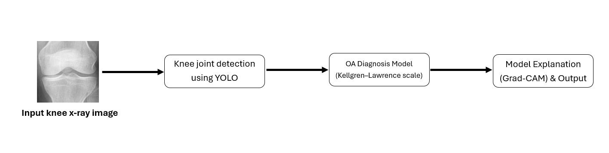
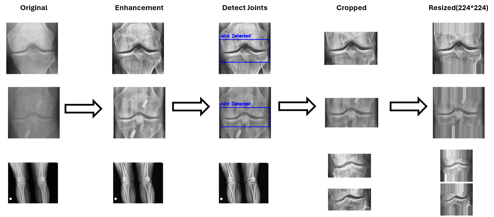
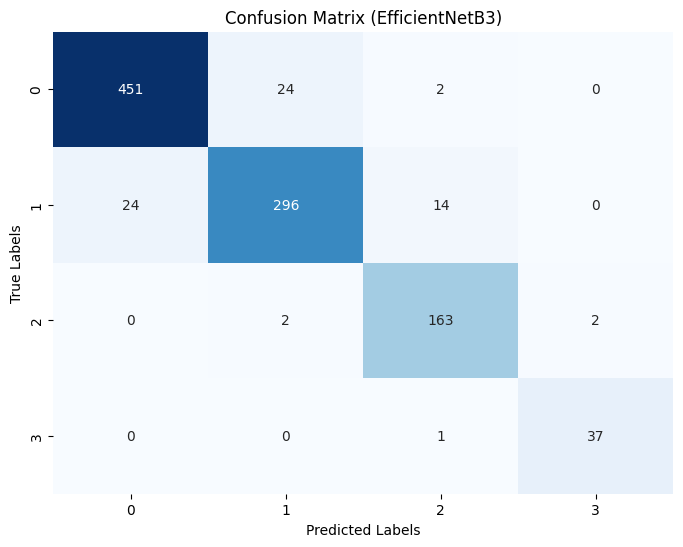
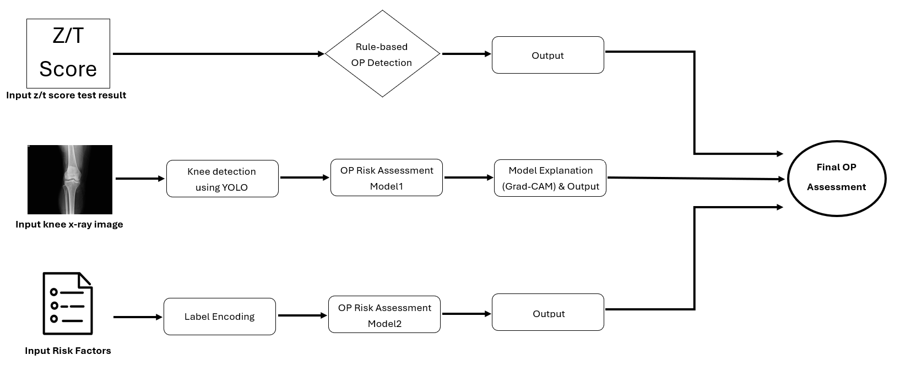
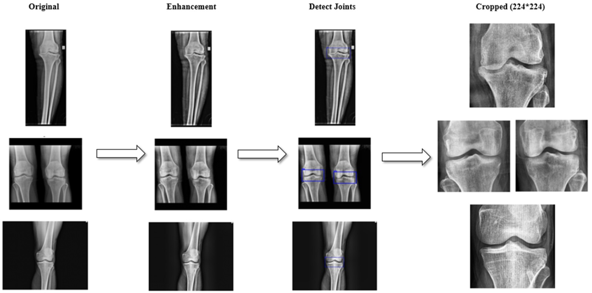
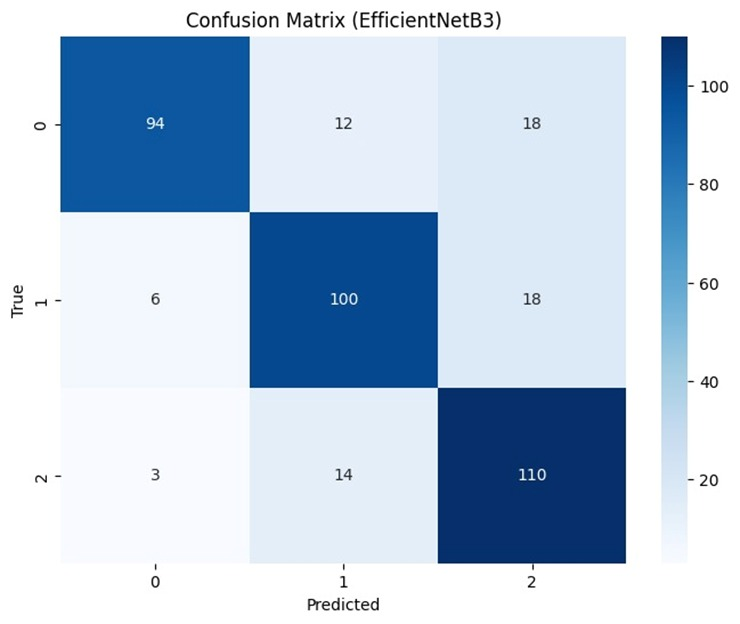
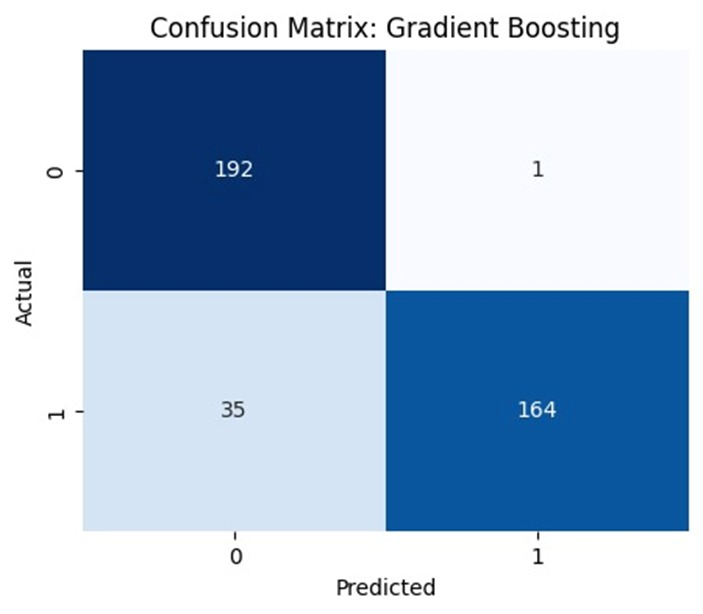
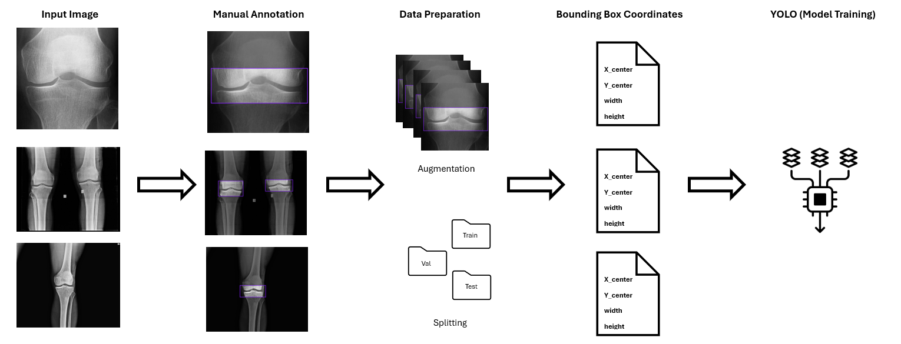

# Osteo-by-AI 🤖🦴🩻
End-to-end AI framework for osteoarthritis and osteoporosis diagnosis

## Abstarct
This project, titled “Osteo by AI”, introduces an intelligent diagnostic system for detecting two major bone disorders: osteoarthritis and osteoporosis.

It employs an integrated AI framework combining deep learning, ensemble modeling, and explainable AI techniques for automated and accurate diagnosis. A YOLO-based helper model is used for knee joint localization, followed by transfer learning for OA classification and a multi-source ensemble approach for OP diagnosis, leveraging imaging, clinical, and rule-based submodels.

Data preprocessing, augmentation, and Grad-CAM visualization enhance both model performance and interpretability. Developed and tested on publicly available datasets, the system achieved promising results and was deployed via a web-based interface for real-time clinical support, with further validation recommended for broader application.

The project aims to contribute to early detection and monitoring of bone diseases, especially in regions with limited access to medical expertise. Results demonstrate promising accuracy, confirming the potential of artificial intelligence in medical imaging and diagnostics.

## 1- Osteoarthritis (OA)

### System Design

### Preprocessing Steps

### Results

ACC = .93

### Front-End

  
  
  

## 2- Osteoporosis (OP)

### System Design

### Preprocessing Steps (Images)

### Results (Images Model)

Acc = .81

### Results (Risk Factors Model)

Acc = .91

### Front-End

  
  
  

## Helper Model : YOLOv8 Training — [Roboflow](https://roboflow.com)

